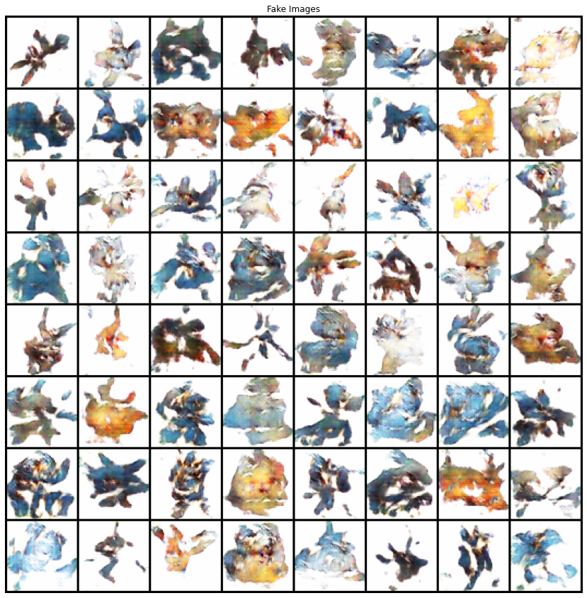

# DCGAN for Novel Pokemon Generation
Development of a Deep Convolutional Generative Adversarial Network for generating novel 64x64 Pokemon images. Code is largely adapted from the PyTorch DCGAN Tutorial: https://pytorch.org/tutorials/beginner/dcgan_faces_tutorial.html

Dataset: https://www.kaggle.com/kvpratama/pokemon-images-dataset#

## Results
While leaving much scope for improvement, after just 60 epochs the generative network has began to replicate common structures found within the existing Pokemon images.

Project by Jack Foster
